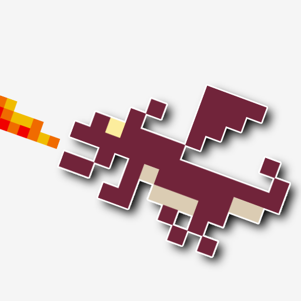

## Works

  

**[Minifield](https://play.google.com/store/apps/details?id=org.hideckies.minifield)**

 

  

**[Fortress House](https://play.google.com/store/apps/details?id=org.hideckies.fortresshouse)**

 

## Links

[Twitter](https://twitter.com/hideckies)  
[GitHub](https://github.com/hideckies)
